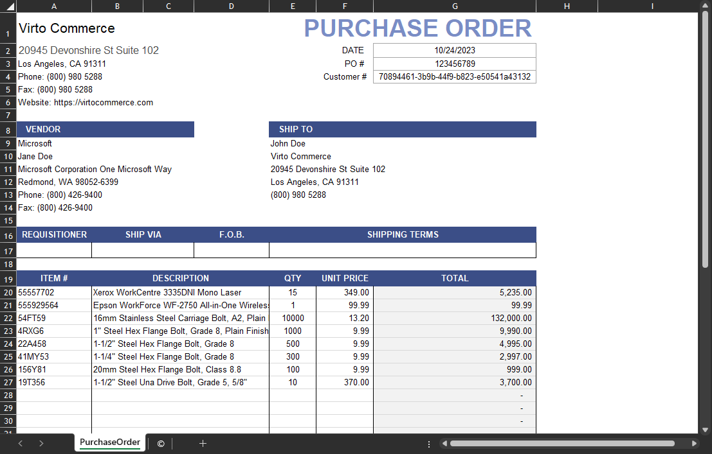
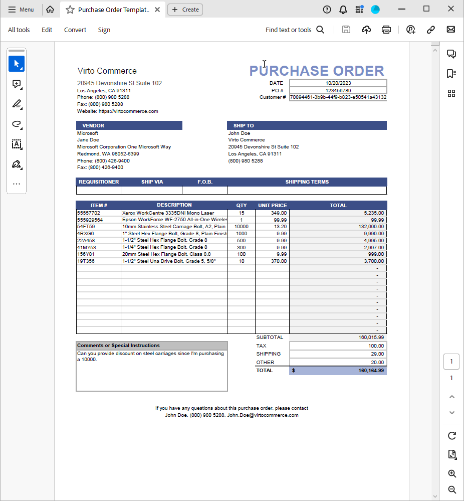
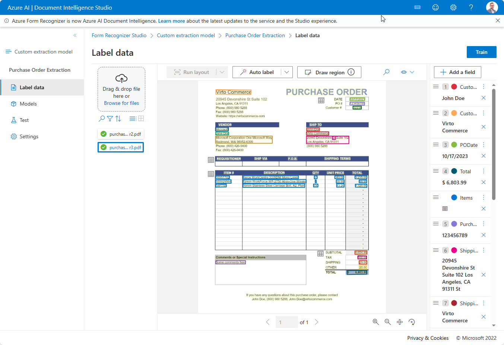
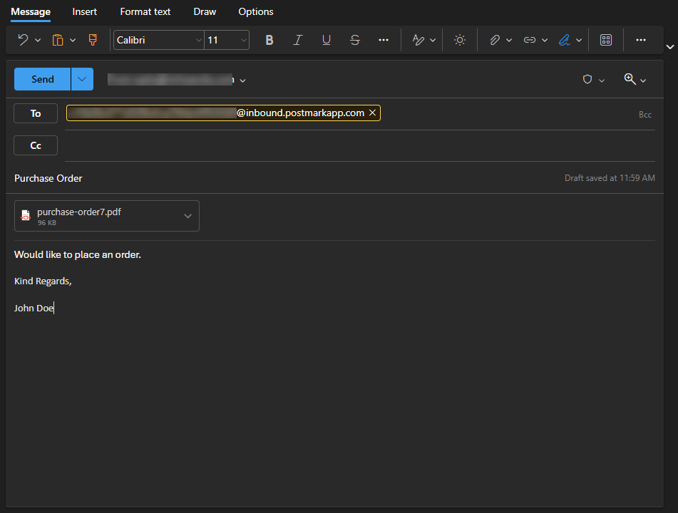
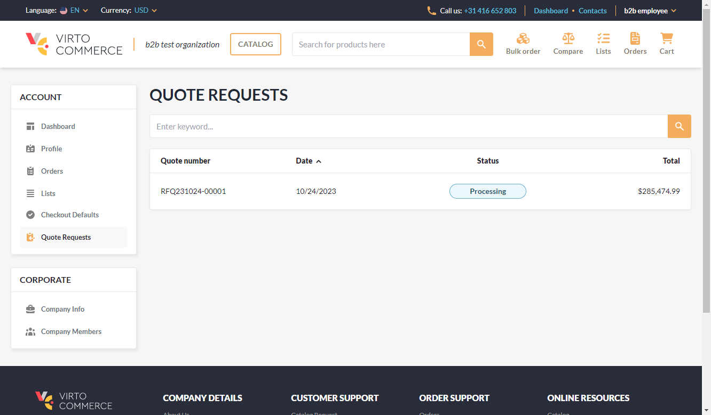
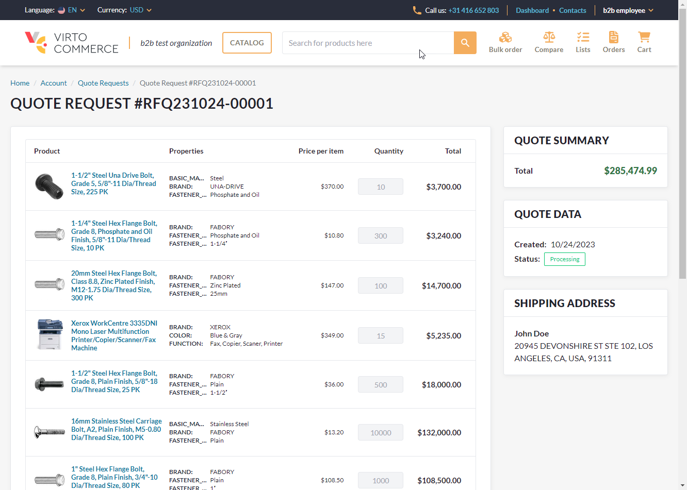

# Intelligent Document Parsing

## Overview

This module uses [Azure AI Document Intelligence](https://learn.microsoft.com/en-us/azure/ai-services/document-intelligence) to injest documents into virto commerce platform.

## Functional Requirements

1. You must have configured AI Document Intelligence.
2. Postman inbound email service.

## Scenarios

The primary scenario is an ability to send Purchase Order via email in custom format that will then be converted into quotes within Virto Commerce.

Purchase Order can be created using supplied excel file template or any other PO generating software

Export Purchase Order into PDF

Use Azure AI Document Intelligence Studio to train on the supplied document

After the training, you can send email with PO attached to an inbound email address

Email will then be processed by Virto Commerce to create a quote, quote is then submitted for processing

## Web API

Web API documentation for each module is built out automatically and can be accessed by following the link bellow:
<https://link-to-swager-api>

## Database Model

## Related topics

[Some Article1](some-article1.md)

[Some Article2](some-article2.md)

## License

Copyright (c) Virto Solutions LTD.  All rights reserved.

Licensed under the Virto Commerce Open Software License (the "License"); you
may not use this file except in compliance with the License. You may
obtain a copy of the License at

<http://virtocommerce.com/opensourcelicense>

Unless required by applicable law or agreed to in writing, software
distributed under the License is distributed on an "AS IS" BASIS,
WITHOUT WARRANTIES OR CONDITIONS OF ANY KIND, either express or
implied.
